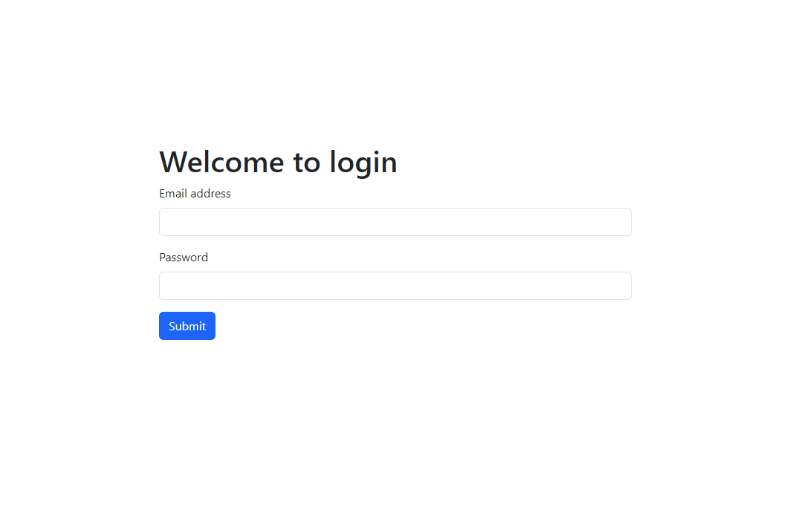
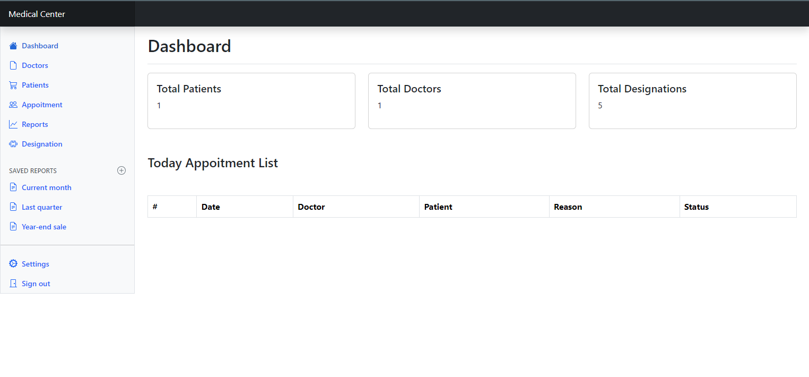
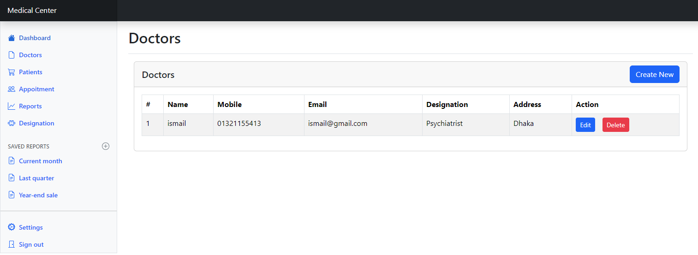
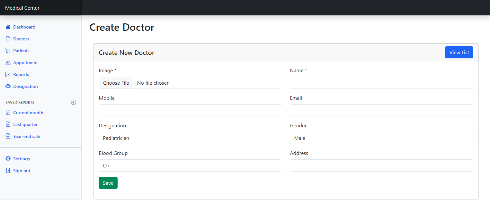
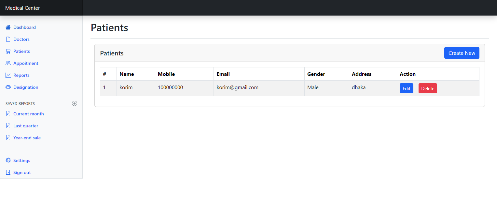
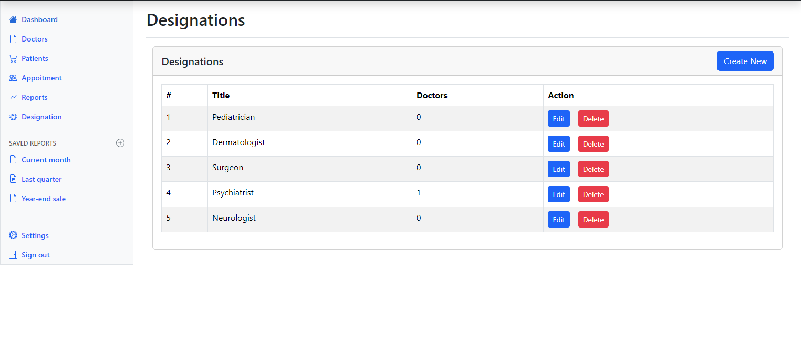

# Laravel simple medical report

This template provides a minimal setup to get laravel, New application

# Theme content design for login page

# Theme content design for home page

# Theme content design for doctor list and create page

# Theme content design for patient list and create page

# Theme content design for designation list and create page

